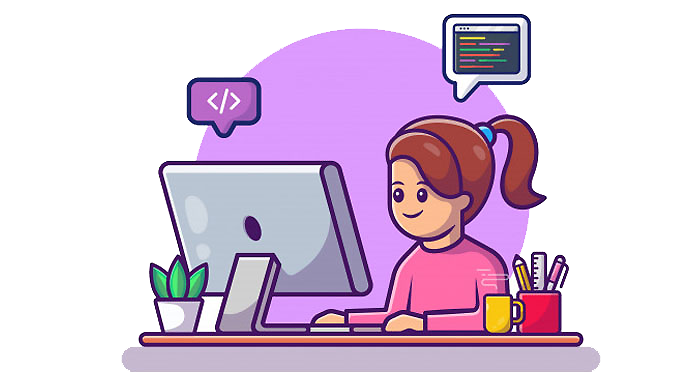

  
  <h1>✨ Hi there ✨</h1>

I'm Constanza, I'm an Audiovisual Engineering student and a Software Developer in development :wink: 
I first learned programming in 2019 and I really loved it. The next year, in 2020, my classmates needed a programmer for our final-anual-group-project and I signed up for the challenge, despite of being a newbie. And it was the best decision I could ever made. Since then, I decided to keep learning and realized that I had discovered my passion and better yet, my vocation. 

#### :computer: I know about...
    
    
  
  

<!--  --> 

#### :computer: I know some things about...
   
   
 

#### :computer: I want to learn about...
   
  
  
 

#### :computer: My favorite editor is ...

##### And I know how to  

### :paperclip: Here are some of my projects
-comming soon-

### :paperclip: Here are some of my collaborations
[Party-Bot](https://github.com/sebagalli9/PartyBot)
